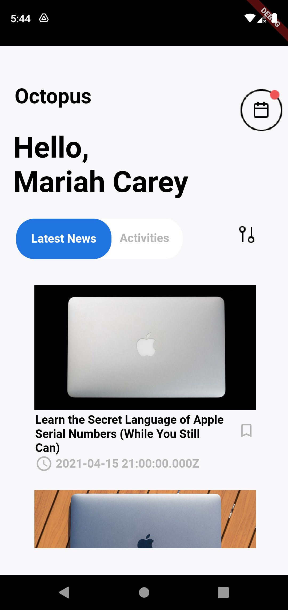
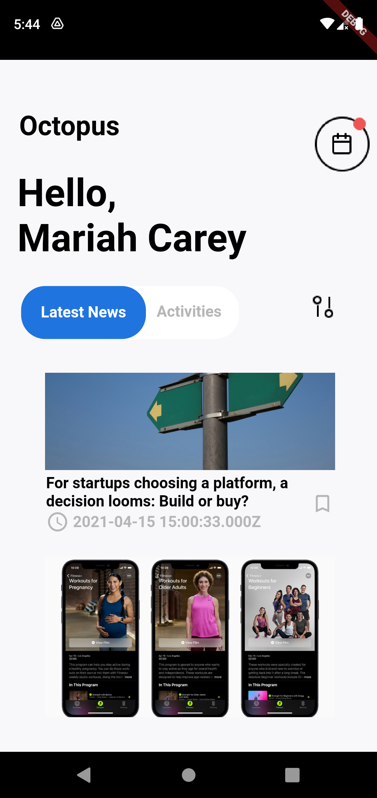
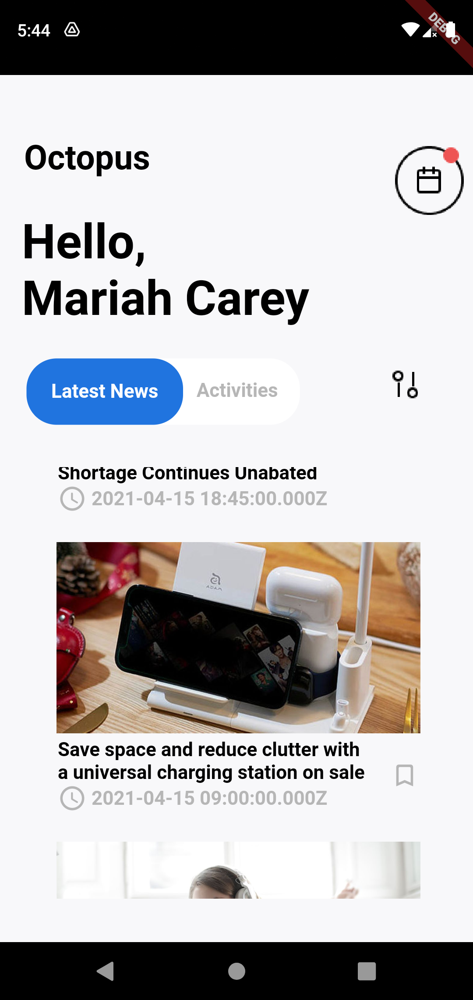

# Project Description:
1. **Name:** COMET News
2. **Short Description:** This project is built under Appophilia competition conducted by Equninox. We have took the reference from Mock1 to make the job done.

# Team Description:
1. **Name:** COMET Labs

# Contributors: 🌟

Thanks goes to these wonderful people ✨:

<table>
	<tr>
    <td align="center">
            <a href="https://github.com/cyber-venom003">
               
              <b>Tejas Agarwal</b>
            </a> 
   </td>
   <td align="center">
            <a href="https://github.com/raghav1701">
               
              <b>Raghav Agarwal</b>
            </a> 
   </td> 
</table>

# Glimpses of the Project:

